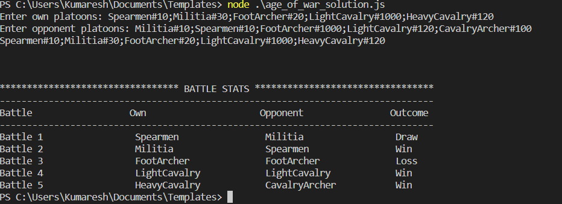

# Age of War

This program simulates a medieval battle where a player has a set of platoons with different types of soldiers and faces an opponent with their platoons. The goal is to find an arrangement of the player's platoons that can win at least 3 out of 5 battles against the opponent.

## Installation

1. Clone the repository or download the source code.
2. Ensure you have [Node.js](https://nodejs.org) installed on your machine.

## How to run
node index.js 

## Screenshots

Without Hardcoded input

With CMD input

## Areas of Improvements
- Tests can be added
- Modules can be made better

## Design Patterns

### Decorator Design Pattern

The Decorator design pattern is used to dynamically add additional attributes or behavior to soldier objects without modifying their original classes. The `SoldierDecorator` abstract class extends the `Soldier` class, and the `ArcherDecorator` and other decorator classes extend `SoldierDecorator`. This pattern enables us to add new attributes or behavior to soldier objects, such as extra attributes for archers, without directly modifying the soldier classes.

### Separation of Concerns

The code separates the battle simulation logic (index.js) from other modules such as constants/constants.js, algo/bruteForceAlgo.js, and outputUtils/outputUtils.js. Each module has a specific responsibility, promoting maintainability and code readability.

### Dependency Injection 
The Soldier class uses dependency injection to receive the battle outcome strategy (DefaultBattleOutcomeStrategy) through its constructor. This allows for easier testing and flexibility when using different battle outcome strategies.

### Encapsulation
Classes such as  DefaultBattleOutcomeStrategy encapsulate their internal logic and data, providing an interface for other modules to interact with them.

## SOLID Principles

### Single Responsibility Principle (SRP)

Each class in the code has a single responsibility. For example, the `Soldier` class is responsible for representing a soldier type and holds the battle outcome strategy. 

### SOLID Principles in the Code

#### Single Responsibility Principle (SRP)

The `Soldier` class follows SRP as it is responsible for representing a soldier, maintaining its type and count, and handling battle outcome strategies.

#### Liskov Substitution Principle (LSP)

While there are no explicit class hierarchies or inheritance relationships in the provided code, the flexibility in accepting different battle outcome strategies through dependency injection in the `Soldier` class aligns with the spirit of LSP.

#### Interface Segregation Principle (ISP)

The code does not explicitly define interfaces, so the ISP doesn't apply directly in this case. However, the code separates concerns between different modules, adhering to the essence of ISP, where classes or modules should not be forced to depend on methods they do not use.

#### Dependency Inversion Principle (DIP)

The `Soldier` class follows DIP by accepting a battle outcome strategy (`DefaultBattleOutcomeStrategy`) through its constructor. This allows for different strategies to be injected and used without modifying the `Soldier` class itself.

While not all the SOLID principles are explicitly evident in the code, the codebase does demonstrate adherence to some of the principles, particularly the Single Responsibility Principle and Dependency Inversion Principle, which contribute to the modularity and maintainability of the code.

## Conclusion

The Age of war simulation program exemplifies the use of SOLID principles and design patterns to create an extensible, maintainable, and well-organized solution. The Strategy, Abstract Factory, and Decorator patterns are employed to encapsulate varying behaviors, facilitate the creation of related objects, and dynamically add attributes or behavior, respectively. Adhering to the SOLID principles ensures that the program is flexible, robust, and adheres to best practices in object-oriented design.